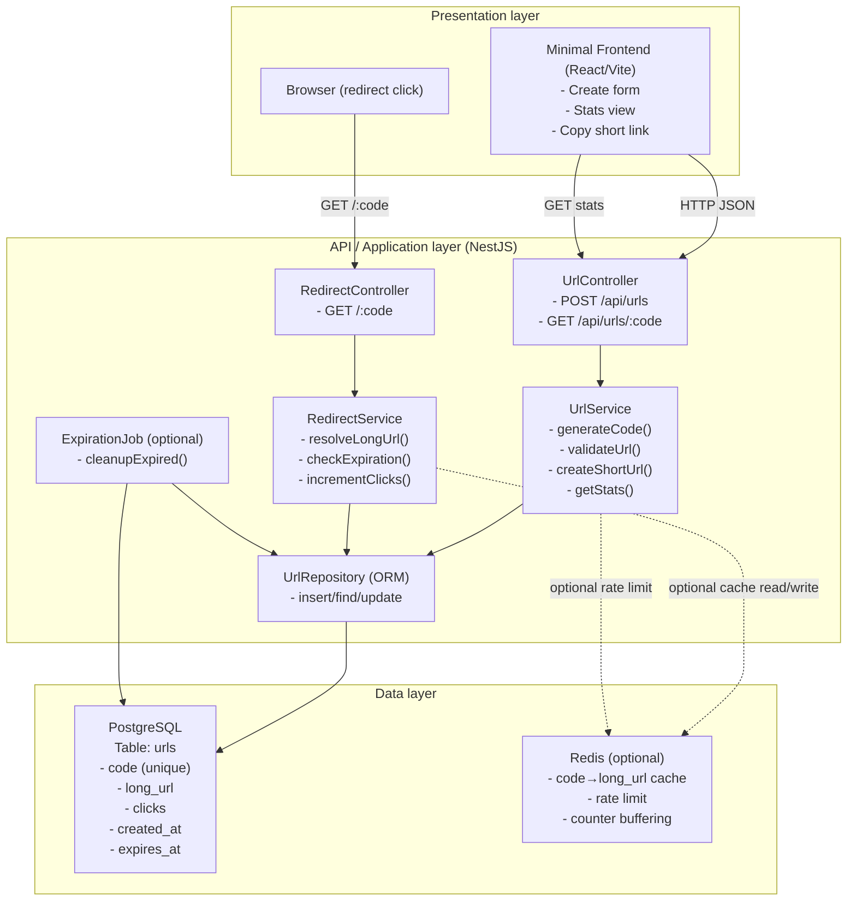

# Architecture (Mermaid) — URL Shortener

**Target stack:** NestJS (REST API) + PostgreSQL + React (Vite) (+ optional Redis)  
**Core features:** random short code, redirect + click counter, expiration

## Module / Layer diagram



## Data flow (Sequence)

```mermaid
sequenceDiagram
  autonumber

  participant U as User (Frontend)
  participant API as NestJS REST API
  participant RED as Redis (optional)
  participant DB as PostgreSQL

  rect rgba(220,220,220,0.25)
  note over U,DB: Flow 1 — Create short link (POST /api/urls)
  U->>API: POST /api/urls { longUrl, expiresAt? }
  API->>DB: INSERT url (generate random code; retry on collision)
  DB-->>API: created record { code, ... }
  API-->>U: 201 { shortUrl, code, ... }
  end

  rect rgba(220,220,220,0.25)
  note over U,DB: Flow 2 — Redirect + click counter (GET /:code)
  U->>API: GET /:code
  opt Redis cache enabled
    API->>RED: GET code
    alt Cache hit
      RED-->>API: longUrl (+ expiresAt?)
    else Cache miss
      RED-->>API: null
      API->>DB: SELECT * FROM urls WHERE code=?
      DB-->>API: url record
      API->>RED: SET code -> longUrl (TTL ~= expiresAt)
    end
  end
  alt Not found
    API-->>U: 404 Not Found
  else Expired
    API-->>U: 410 Gone (or 404)
  else Active
    par Increment clicks
      API->>DB: UPDATE urls SET clicks = clicks + 1 WHERE code=?
    and Redirect
      API-->>U: 302 Location: longUrl
    end
  end
  end

  rect rgba(220,220,220,0.25)
  note over U,DB: Flow 3 — Stats (GET /api/urls/:code)
  U->>API: GET /api/urls/:code
  API->>DB: SELECT * FROM urls WHERE code=?
  DB-->>API: url record
  API-->>U: 200 { longUrl, clicks, createdAt, expiresAt, status }
  end
```
